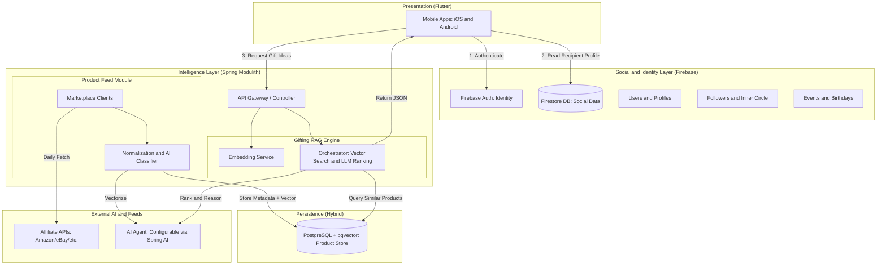

# WiseGift — System Architecture

## 1. Stack

| Layer | Technology |
|---|---|
| Mobile client | Flutter (iOS, Android) |
| Identity | Firebase Authentication |
| Social / real-time data | Cloud Firestore |
| API / business logic | Spring Modulith (Java) |
| AI orchestration | Spring AI |
| Semantic search | PostgreSQL + pgvector (vector size 1536) |
| Product ingestion | Affiliate APIs (Amazon, eBay, Awin, etc.) |

---

## 2. High-Level Architecture



---

## 3. Component Responsibilities

### Presentation — Flutter
The mobile client (iOS and Android). Handles authentication via Firebase Auth SDK, reads recipient profiles directly from Firestore, and calls the Spring REST API for gift recommendations and catalog browsing.

### Social and Identity Layer — Firebase
- **Firebase Authentication:** Source of truth for user identity. Issues JWTs consumed by the Spring API for protected endpoints.
- **Firestore:** Stores the active social graph and user-generated content with low-latency document access.
  - `users/{uid}` — profile data (name, birthday, gender, interests, residence country)
  - `events/{uid}/events/{eventId}` — birthdays and occasions

### Intelligence Layer — Spring Modulith
Single deployable unit composed of two internal modules with clear boundaries:

- **Catalog Module:** Offline worker. Pulls products from affiliate marketplaces, normalises data into the internal `Product` schema, classifies categories via AI, and stores metadata plus embedding vectors in PostgreSQL. Exposes catalog and collection endpoints to the Flutter client and admin tooling.
- **Gifting RAG Engine:** Online inference engine. Receives a `RecipientProfile` from the Flutter client, orchestrates the full RAG pipeline (see Section 4), and returns ranked gift recommendations.

### Persistence
- **Firestore:** Optimised for low-latency document reads and real-time social interactions.
- **PostgreSQL + pgvector:** Stores the semantic product catalog. Product embeddings are 1536-dimensional vectors used for cosine-similarity retrieval. The `embedding` column is never exposed through the API.

---

## 4. RAG Pipeline

When a user requests gift ideas for a recipient:

1. **Context transfer** — Flutter fetches the target recipient's profile from Firestore and POSTs it to `POST /api/v1/gifts/recommendations` as a `RecipientProfile` JSON object.
2. **Vectorise** — Spring embeds the profile's interests and attributes into a 1536-dimension Interest Vector via the configured Embedding Model (Spring AI).
3. **Retrieve** — PostgreSQL performs a pgvector cosine-similarity search between the Interest Vector and the product catalog embeddings.
4. **Filter** — Results are filtered by `maxBudget`, `residenceCountry`, and any additional business rules (age, gender, active flag).
5. **Augment** — The top matching products plus the full profile context are injected into a dynamic reasoning prompt.
6. **Reason** — Spring AI sends the prompt to the configured AI Agent (e.g., OpenAI). The agent returns the top 5 picks, each with a personalised explanation.

---

## 5. Database Schema

### PostgreSQL — `products`

| Column | Type | Constraints / Notes |
|---|---|---|
| id | BIGINT | PK, auto-increment |
| provider_id | VARCHAR | e.g. `"awin"`, `"manual"` |
| provider_product_id | VARCHAR | |
| provider_categories | text[] | |
| name | VARCHAR | |
| description | VARCHAR(1000) | |
| category | VARCHAR | |
| price | DECIMAL(10,2) | |
| currency | VARCHAR | ISO 4217 |
| image_url | VARCHAR | |
| country | VARCHAR | ISO 3166-1 alpha-2 |
| affiliate_url | VARCHAR(2000) | |
| delivery_days | INTEGER | nullable, calendar days |
| active | BOOLEAN | default `true` |
| min_age | INTEGER | nullable |
| max_age | INTEGER | nullable |
| gender | VARCHAR | nullable |
| embedding | vector(1536) | pgvector; never exposed via API |
| created_at | TIMESTAMP | |

### PostgreSQL — `gift_collections`

| Column | Type | Constraints / Notes |
|---|---|---|
| id | BIGINT | PK, auto-increment |
| title | VARCHAR(200) | |
| category | VARCHAR(100) | e.g. `"Birthday"`, `"Baby"`, `"Wedding"` |
| from_price | DECIMAL(10,2) | |
| cover_image_url | VARCHAR(2000) | |
| type | VARCHAR | enum `CollectionType` |
| active | BOOLEAN | |
| ranking_context | TEXT | text used to generate pgvector embedding for ranking |
| max_budget | DECIMAL(10,2) | nullable |
| min_budget | DECIMAL(10,2) | nullable |
| max_delivery_days | INTEGER | nullable; filters out slow-shipping products |
| seasonal_month | INTEGER | 1–12; `null` = always eligible |
| seasonal_day | INTEGER | cutoff day within `seasonal_month` |
| rotation_weight | INTEGER | default `1`; higher = more frequent in popular list |
| created_by | VARCHAR | Firebase UID for user-created; `null` for programmatic |
| created_at | TIMESTAMP | |
| updated_at | TIMESTAMP | |

### Firestore Collections (Firebase)

| Collection path | Fields |
|---|---|
| `users/{uid}` | name, birthday, gender, interests[], residenceCountry |
| `users/{uid}/blocked_users/{targetId}` | blocked user record |
| `users/{uid}/private_birthdays/{birthdayId}` | birthday agenda entries |
| `users/{uid}/contacts/{contactId}` | imported device contacts |
| `users/{uid}/savedCollections/{docId}` | saved editorial collections |
| `events/{uid}/events/{eventId}` | occasions and birthdays |

---

## 6. API Contracts

### Authentication

| Mechanism | Used by |
|---|---|
| Firebase JWT (`Authorization: Bearer <token>`) | Client-facing write endpoints |
| `X-Internal-Token` header | Admin and internal endpoints |
| None (public read) | Catalog read endpoints |

---

### Module: Catalog — `/api/v1/`

---

#### 1. `GET /api/v1/products`
List all active products.

- **Auth:** none
- **Response:** `Product[]`

---

#### 2. `GET /api/v1/products/search`
Search products with optional filters.

- **Auth:** none
- **Query parameters:**

| Param | Type | Required |
|---|---|---|
| keyword | string | no |
| minPrice | decimal | no |
| maxPrice | decimal | no |
| gender | string | no |
| country | string (ISO) | no |
| category | string | no |

- **Response:** `Product[]`

---

#### 3. `GET /api/v1/products/{id}`
Get a single product by ID.

- **Auth:** none
- **Path param:** `id` (Long)
- **Response:** `Product`

---

#### 4. `POST /api/v1/products`
Create a product.

- **Auth:** Firebase JWT
- **Request body:** `Product`
- **Response:** `Product`

---

#### 5. `DELETE /api/v1/products/{id}`
Delete a product.

- **Auth:** Firebase JWT
- **Path param:** `id` (Long)
- **Response:** 204 No Content

---

#### 6. `GET /api/v1/products/availability`
Check availability for up to 100 product IDs.

- **Auth:** none
- **Query parameters:**

| Param | Type | Required |
|---|---|---|
| ids | comma-separated Longs | yes (max 100) |

- **Response:** `ProductAvailability[]`

```json
[
  { "id": 1, "active": true },
  { "id": 2, "active": false }
]
```

---

#### 7. `POST /api/v1/products/imports/sync`
Trigger an affiliate feed sync (internal use).

- **Auth:** internal
- **Response:** 200 OK

---

#### 8. `GET /api/v1/collections/popular`
Get popular collections ranked by rotation weight.

- **Auth:** none
- **Query parameters:**

| Param | Type | Required | Default | Max |
|---|---|---|---|---|
| limit | integer | no | 10 | 20 |
| country | string (ISO) | no | — | — |

- **Response:**

```json
{
  "collections": [ GiftCollectionResponse ]
}
```

---

#### 9. `GET /api/v1/collections/{id}`
Get collection detail with ranked products.

- **Auth:** none
- **Path param:** `id` (Long)
- **Query parameters:**

| Param | Type | Required |
|---|---|---|
| country | string (ISO) | no |

- **Response:** `GiftCollectionResponse`

---

#### 10. `POST /api/v1/collections`
Create a user-defined collection.

- **Auth:** Firebase JWT
- **Query parameters:**

| Param | Type | Required |
|---|---|---|
| title | string | yes |
| category | string | yes |
| fromPrice | decimal | yes |
| coverImageUrl | string | no |
| createdBy | string (Firebase UID) | yes |

- **Response:** `GiftCollectionResponse`

---

### Admin Endpoints — `/api/v1/admin/` (`X-Internal-Token` required)

---

#### 11. `POST /api/v1/admin/products`
Add a product to the catalog.

- **Auth:** `X-Internal-Token`
- **Request body:** `AdminProductRequest`
- **Response:** `Product` (201 Created)

---

#### 12. `PATCH /api/v1/admin/products/{id}`
Update product fields (partial update).

- **Auth:** `X-Internal-Token`
- **Path param:** `id` (Long)
- **Request body:** `AdminProductRequest` (all fields optional)
- **Response:** `Product`

---

#### 13. `DELETE /api/v1/admin/products/{id}`
Soft-deactivate a product (sets `active = false`).

- **Auth:** `X-Internal-Token`
- **Path param:** `id` (Long)
- **Response:**

```json
{ "status": "deactivated", "id": "123" }
```

---

#### 14. `POST /api/v1/collections/generate`
Trigger pgvector-based collection generation.

- **Auth:** `X-Internal-Token`
- **Query parameters:**

| Param | Type | Required |
|---|---|---|
| limit | integer | no (0 = unlimited) |

- **Response:**

```json
{ "generated": 5 }
```

---

### Module: Gift Recommendation — `/api/v1/gifts/`

---

#### 15. `POST /api/v1/gifts/recommendations`
Run the RAG pipeline and return AI-ranked gift picks.

- **Auth:** none (caller is Flutter app; recipient profile sourced from Firestore client-side)
- **Request body:** `RecipientProfile`

```json
{
  "name": "string",
  "birthday": "ISO-8601 date",
  "gender": "string",
  "interests": ["string"],
  "residenceCountry": "ISO-3166 code",
  "eventType": "string",
  "relationship": "string",
  "maxBudget": 0.00
}
```

- **Response:** `ProductSearchResult[]`

```json
[
  {
    "name": "string",
    "price": 0.00,
    "currency": "string",
    "imageUrl": "string",
    "affiliateUrl": "string",
    "source": "string"
  }
]
```

---

### Internal Cross-Service — `/web/v1/`

---

#### 16. `POST /web/v1/gifts/collection-products`
Rank products for a collection. Called internally by the Catalog module when resolving a collection's product list.

- **Auth:** internal
- **Request body:** `CollectionRankRequest`

```json
{
  "collectionContext": "string",
  "maxBudget": 0.00,
  "minBudget": 0.00,
  "maxDeliveryDays": 0,
  "limit": 0
}
```

- **Response:** `CollectionProductResponse[]`

```json
[
  {
    "id": 0,
    "name": "string",
    "imageUrl": "string",
    "price": 0.00,
    "affiliateUrl": "string"
  }
]
```

---

## 7. Schema Object Reference

### `Product`
```
id, providerId, providerProductId, providerCategories[], name, description,
category, price, currency, imageUrl, country, affiliateUrl, deliveryDays,
active, minAge, maxAge, gender, createdAt
```
Note: `embedding` is persisted but never serialised in API responses.

### `GiftCollectionResponse`
```
id, name, category, fromPrice, coverImageUrl, type, createdAt,
products: GiftProduct[]
```

### `GiftProduct`
```
id, name, imageUrl, price, currency, affiliateUrl
```

### `RecipientProfile`
```
name, birthday, gender, interests[], residenceCountry, eventType,
relationship, maxBudget
```

### `ProductSearchResult`
```
name, price, currency, imageUrl, affiliateUrl, source
```

### `AdminProductRequest`
```
name, description, price, currency, country, category, imageUrl,
affiliateUrl, deliveryDays
```
All fields are optional for `PATCH`; required for `POST`.

### `ProductAvailability`
```
id, active
```

### `CollectionRankRequest`
```
collectionContext, maxBudget, minBudget, maxDeliveryDays, limit
```

### `CollectionProductResponse`
```
id, name, imageUrl, price, affiliateUrl
```

---

## 8. Flutter Integration Notes

### 8.1 Authentication flow

Firebase Auth issues a short-lived JWT after sign-in. Attach it to every protected request:

```
Authorization: Bearer <firebase-id-token>
```

Refresh the token before each request using `FirebaseAuth.instance.currentUser?.getIdToken()` (the Firebase SDK handles silent refresh automatically).

**Public endpoints (no auth header needed):**
- `GET /api/v1/products`, `GET /api/v1/products/search`, `GET /api/v1/products/{id}`
- `GET /api/v1/products/availability`
- `GET /api/v1/collections/popular`, `GET /api/v1/collections/{id}`
- `POST /api/v1/gifts/recommendations` *(see flag below)*

**Protected endpoints (Firebase JWT required):**
- `POST /api/v1/products`, `DELETE /api/v1/products/{id}`
- `POST /api/v1/collections`

> **Flag for backend:** `POST /api/v1/gifts/recommendations` is currently marked auth-free, yet its request body carries personal data (name, birthday, interests). This creates a privacy/abuse risk. Consider requiring a Firebase JWT on this endpoint and validating that the caller is an authenticated app user.

---

### 8.2 Firestore to Spring handoff (recommendation flow)

1. Resolve the target recipient's Firestore UID (from the social graph or a deep-link).
2. Read `users/{recipientUid}` from Firestore client-side.
3. Map the document fields to `RecipientProfile` and POST to `POST /api/v1/gifts/recommendations`.

Required `RecipientProfile` fields Flutter must populate from the Firestore document:

| `RecipientProfile` field | Firestore source field | Notes |
|---|---|---|
| `name` | `name` | |
| `birthday` | `birthday` | ISO-8601 date string |
| `gender` | `gender` | |
| `interests` | `interests[]` | string array |
| `residenceCountry` | `residenceCountry` | ISO 3166-1 alpha-2 |
| `eventType` | — | supplied by the requesting user at call time (e.g. `"Birthday"`) |
| `relationship` | — | supplied by the requesting user at call time (e.g. `"Friend"`) |
| `maxBudget` | — | supplied by the requesting user at call time |

`eventType`, `relationship`, and `maxBudget` are not stored in Firestore; collect them from the user in the gift-search flow before calling the API.

---

### 8.3 API base URL convention

| Prefix | Audience | Flutter should call? |
|---|---|---|
| `/api/v1/` | Flutter client (public and authenticated) | Yes |
| `/api/v1/admin/` | Server-side ops tooling; requires `X-Internal-Token` | Never |
| `/web/v1/` | Internal cross-service calls (Catalog → RAG Engine) | Never |

Configure a single `apiBaseUrl` constant (e.g. `https://api.wisegift.app`) and prepend `/api/v1/` for all Flutter HTTP calls. Do not hard-code `/web/v1/` or `/api/v1/admin/` paths anywhere in the Flutter codebase.

---

### 8.4 Country filtering

The product catalog is country-scoped. Always pass the authenticated user's own `residenceCountry` (read from `users/{uid}` in Firestore) as the `country` query parameter on collection and search endpoints:

- `GET /api/v1/collections/popular?country=PT`
- `GET /api/v1/collections/{id}?country=PT`
- `GET /api/v1/products/search?country=PT&...`

Omitting `country` returns unfiltered results and may surface products that are not available for delivery to the user.

---

### 8.5 Availability check pattern

Before rendering any saved or cached collection (e.g. a wishlist or bookmarked collection), gray-out products that are no longer active:

1. Collect all product IDs from the local state (up to 100 per batch).
2. Call `GET /api/v1/products/availability?ids=1,2,3,...` — no auth required.
3. Map the response array (`id`, `active`) over the local product list.
4. Render products where `active: false` as visually disabled (grayed card, no tap target for affiliate link).

For lists exceeding 100 products, split into sequential batches of 100 before rendering. Cache availability results for the duration of the screen session; do not re-poll on every frame.
