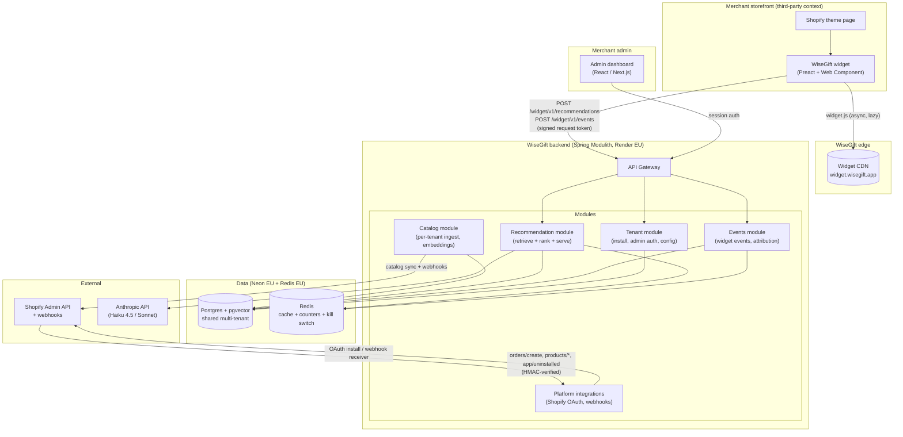

# WiseGift — System Architecture

> B2B rewrite. Supersedes the pre-2026-09-29 B2C architecture (Firebase Auth +
> Firestore + Flutter). Historical context in `docs/decisions.md` (2026-09-29
> entries). Product surface in `docs/product/spec.md`; business & cost
> guardrails in `docs/growth/gtm-b2b.md`.

---

## Environments

| Environment | Widget CDN | Admin dashboard | Backend API | Postgres (Neon) | Redis |
|---|---|---|---|---|---|
| **Production** | `https://widget.wisegift.app` | `https://admin.wisegift.app` | `https://api.wisegift.app` | Neon EU (prod project) | Managed Redis EU (prod) |
| **Staging** | `https://widget-staging.wisegift.app` | `https://admin-staging.wisegift.app` | `https://api-staging.wisegift.app` | Neon EU (staging project) | Managed Redis EU (staging) |
| **Local** | `http://localhost:5173` | `http://localhost:3000` | `http://localhost:8080` | Neon EU (staging branch) or local docker | local docker |

All production and staging infra hosted in **EU regions only** (see `docs/decisions.md` 2026-09-29 "Frozen MVP scope"). Adding US region requires an explicit PO decision + DPA update.

Backend selects environment via `SPRING_PROFILES_ACTIVE=production|staging|local`. Widget bundle is built once per release with hash-based cache-busting (`widget.<hash>.js`). Admin frontend selects the API base via a build-time env var.

---

## 1. Stack

| Layer | Technology | Notes |
|---|---|---|
| Embeddable widget | Preact + Web Components, Shadow DOM | ≤ 50 KB gzipped, async, CDN-served |
| Merchant admin dashboard | Next.js (App Router) | Session auth, same-origin API calls. See `decisions.md` 2026-09-29 "Architecture open questions closed" |
| Backend | Spring Modulith (Java) | Hexagonal per module; evolved from `wisegift-backend` |
| Recommendation LLM | Anthropic Claude via API | Haiku 4.5 default; Sonnet escalation behind per-tenant flag |
| Embeddings | OpenAI `text-embedding-3-small` (1536d, Matryoshka-reducible) | Stored in pgvector, model version tracked per vector. EU covered via OpenAI DPA. See `decisions.md` 2026-09-29 "Architecture open questions closed" |
| Primary DB | PostgreSQL + pgvector (Neon EU) | Shared multi-tenant, `tenant_id NOT NULL` |
| Cache + rate limits | Redis (managed, EU) | Response cache, per-tenant usage cap, per-session rate limit, kill switch |
| Platform integrations | Shopify Admin API + Theme App Extensions | MVP; VTEX / SFCC / custom REST post-MVP behind common adapter |
| Widget CDN | Cloudflare or Fastly | Long TTL + hash-based cache-busting |
| Hosting | Render EU (backend + admin) | Widget CDN separate |
| Observability | Structured JSON logs, per-tenant cost telemetry stream | Alerting on daily-spend threshold per tenant |
| Identity — merchant admin | Email + password + Google OAuth (Spring Security + BCrypt) | MVP is single-user per tenant, no SSO, no MFA. See `decisions.md` 2026-09-29 "Architecture open questions closed" |
| Identity — widget shopper | None (anonymous session ID) | No PII, session ID in localStorage |
| Identity — widget → API | Short-lived HMAC-signed request tokens (rotates hourly) | Token-issuing endpoint scoped to merchant domain allowlist |
| Identity — Shopify → API | OAuth (per-tenant tokens) + HMAC on webhooks | Standard Shopify pattern |

---

## 2. High-level architecture



---

## 3. Component responsibilities

### Widget (Preact + Web Components)
Runs inside the merchant's storefront (Shopify theme). One tag on the page: `<wisegift-widget data-tenant-id="…" data-placement="…"></wisegift-widget>`, plus one `<script async>` loading `widget.js` from the CDN. Renders with Shadow DOM isolation; inherits brand accent + typography via CSS variables; ≤ 50 KB gzipped total. Emits events to the WiseGift event API. Assigns each browser to exposed (90%) or holdout (10%) on first render.

### Merchant admin dashboard
Standalone web app (React/Next.js). Merchants install the Shopify app, land here for onboarding, widget configuration, placement management, and the analytics dashboard. Single-user per tenant at MVP. Same-origin API access with session auth.

### Backend — Spring Modulith
Single deployable unit (initially — split into services only when scale demands it). Composed of the modules below, each hexagonal (`domain/`, `application/`, `infrastructure/`). Never imports across modules except via ports.

- **Tenant module** — merchant admin identity, tenant lifecycle (create at Shopify install, soft-delete 30 days on uninstall, hard purge), widget config, placement config, per-tenant feature flags. Owns the `tenants` table.
- **Catalog module** — per-tenant catalog ingestion via Shopify Admin API + product-update webhooks, embeddings computed at ingest, nightly reconciliation, precomputed cold recs job. Owns `tenant_products`, `precomputed_recs`.
- **Recommendation module** — the live serving path. Retrieves top-K candidates via pgvector, re-ranks via Claude (Haiku 4.5 default), enforces cost guardrails (usage cap, cache, kill switch, session rate limit), emits cost telemetry. Owns `intent_form_schemas` (versioned per tenant).
- **Events module** — widget event ingestion (widget_shown / widget_engaged / intent_submitted / product_clicked), holdout assignment persistence, attribution joins against order webhooks. Owns `events`, `sessions`, `orders_attributed`.
- **Platform integrations module** — Shopify OAuth install flow, HMAC-verified webhook receiver (`products/*`, `inventory_levels/update`, `orders/create`, `app/uninstalled`), Theme App Extension block metadata. Post-MVP: VTEX / SFCC adapters behind the same `PlatformCatalogSource` / `PlatformOrderSource` ports. Owns `platform_credentials`.

### Data
- **Postgres + pgvector (Neon EU)** — shared multi-tenant, every table with tenant data has `tenant_id UUID NOT NULL` with a composite index leading with `tenant_id`. Embeddings live in pgvector columns.
- **Redis (managed EU)** — response cache (24h TTL), per-tenant usage-cap counters, per-session rate-limit counters, per-tenant kill-switch flag. Ephemeral; no durable data.

### External services
- **Shopify Admin API** — catalog reads, order webhooks, theme extension metadata. Rate limit: 2 req/s leaky-bucket baseline, 40 burst (per tenant).
- **Anthropic API** — Claude Haiku 4.5 for re-ranking and intent parsing (default). Claude Sonnet 4.6 for full-form gift-intent flows behind a per-tenant flag. Every call tagged with `tenant_id` for cost attribution.

---

## 4. Multi-tenancy model

Shared database, strict row-level tenant scoping.

- **Every tenant-scoped table** has `tenant_id UUID NOT NULL` with a composite index `(tenant_id, ...)` leading with tenant.
- **Every request** (except OAuth install and public webhook receivers) is scoped via a request-scoped `TenantContext` bean, populated by:
  - Admin API: session → user → tenant lookup.
  - Widget API: signed request token → `tenant_id` claim + domain allowlist check.
  - Webhook receivers: shop domain → tenant lookup.
- **Every repository method** takes `tenant_id` explicitly or reads it from `TenantContext`. Lint / architecture test flags any raw SQL missing `WHERE tenant_id = ?`.
- **Cross-tenant queries never exist** at the application layer. Cross-tenant analytics jobs (if ever needed) run as scheduled batch jobs with an explicit "cross-tenant" annotation and no request context.
- **Integration tests** seed at least two tenants and assert zero cross-leakage on every read path. Non-negotiable in CI.

### Tenant lifecycle

| Event | Trigger | Effect |
|---|---|---|
| Create | Shopify OAuth install completes | `tenants` row created; `active = false` until wizard completes |
| Activate | Onboarding wizard "Go live" | `active = true`; widget starts rendering; events start recording |
| Soft-delete | Shopify `app/uninstalled` webhook | `active = false`, `soft_deleted_at = now()`; widget serves nothing; catalog sync stops |
| Reactivate | Reinstall within 30 days | `active = true`, `soft_deleted_at = null`; existing tenant record reused |
| Hard purge | Scheduled daily job at 03:00 UTC | Tenants with `soft_deleted_at < now() - 30 days` → all `tenant_id`-scoped rows deleted across every module's tables |

---

## 5. Recommendation pipeline

### Serving policy (live vs. precomputed)

Every recommendation request goes through this decision tree:

1. **Cache lookup** — Redis key `rec:{tenant_id}:{intent_signature}:{context_signature}`, 24h TTL. Hit → return cached response, `served_from = cache`.
2. **Guardrail checks** —
   - Per-tenant usage cap reached this month? → fall through to precomputed.
   - Per-session rate limit reached this hour? → fall through to precomputed.
   - Per-tenant kill switch tripped? → fall through to precomputed.
3. **Intent signal check** — no real intent (shopper has not submitted the intent form, PDP-context view only)? → serve precomputed cold recs for the current SKU.
4. **Live LLM path** —
   - Embed the intent (interests + budget + occasion + context) via the embedding model.
   - Vector search on `tenant_products.embedding` for top-K candidates (K = 50).
   - Re-rank the top-K + intent payload via Claude Haiku 4.5 (or Sonnet if feature flag on).
   - Return top-N (default 5) with `served_from = live_llm`.
5. **Fallback** — LLM error or vector search returns zero → precomputed cold recs; if those are also empty, top-N merchant bestsellers; last resort, hide the recommendation slot. The widget never renders an error state.

### Cost + attribution tagging

Every response tags: `tenant_id`, `placement`, `model`, `input_tokens`, `output_tokens`, `cache_hit`, `served_from`, `latency_ms`. Emitted on every call (not sampled) to the cost telemetry stream. Every response body includes `served_from` for downstream event tagging.

### Precomputed cold recs

- Nightly job per tenant (`03:00 UTC`, offset by tenant hash to smear load).
- For each active SKU, compute top-N recommendations using vector nearest-neighbour + heuristic ranking (price band, category diversity). No LLM calls.
- Stored in `precomputed_recs (tenant_id, source_platform_product_id, rank, recommended_platform_product_id, computed_at)`.
- Served instantly when the live path is over-cap, over-limit, kill-switched, or missing intent signal.
- Re-run on catalog changes exceeding a per-tenant threshold (e.g. >5% of SKUs updated in a day).

### Embeddings

- Computed at ingest, on catalog update, and never at recommendation-serve time.
- Recompute only when title or description changes (skip on price / inventory-only updates).
- Batched per tenant, tagged with `tenant_id` for cost attribution.
- Model version stored on each vector row; model upgrade requires a per-tenant re-embed job, not silent drift.

---

## 6. Cost guardrails infrastructure

Cost guardrails from `docs/growth/gtm-b2b.md` are engineering requirements, not v2. All enforced at the Recommendation module's API layer.

| Guardrail | Backing store | Trigger |
|---|---|---|
| Per-tenant usage cap | Redis counter `cap:{tenant_id}:{YYYY-MM}` | Configurable per tenant; default 50k live-LLM calls / month during pilot |
| Response cache | Redis, 24h TTL | Hit rate target > 60% at steady state |
| Session rate limit | Redis counter `rate:{session_id}:{YYYY-MM-DD-HH}` | Max 20 live-LLM calls / session / hour |
| Kill switch | Redis flag `kill:{tenant_id}` (bool + reason) | Daily-spend threshold from cost telemetry; ops-alert; auto-set true |
| Cost telemetry | Postgres `cost_telemetry` table at MVP; promote to Grafana Cloud EU post-MVP | Every rec call, unsampled. See `decisions.md` 2026-09-29 "Architecture open questions closed" |

Kill switch behaviour: while set, every recommendation call serves from precomputed cold recs. Widget shopper cannot tell. Ops dashboard shows the tenant in "degraded" state until manually reset.

---

## 7. Attribution & event pipeline

### Session lifecycle

- On first widget render on a browser: generate UUID v4 → localStorage key `wg_session_id`, 30-day sliding TTL.
- Assign exposed vs holdout deterministically from the session ID: `hash(session_id) mod 100 < 10 → holdout`, else exposed. Assignment stored on first `widget_shown` event; never re-rolled.
- Every widget event carries `session_id`, `is_holdout`, `tenant_id`, `placement`.

### Event ingest

- Widget batches events (up to 10 / request, 1-second flush interval) and POSTs to `POST /widget/v1/events`.
- Server validates against a strict schema (unknown fields rejected).
- Events enqueued to an in-process async processor; written to `events` table.
- p95 write latency < 100 ms; fire-and-forget from widget's perspective.

### Order attribution

- Shopify `orders/create` webhook → HMAC-verified → filtered at ingest (drop customer PII fields) → stored in `orders_attributed`.
- Session correlation: the widget appends `?wg_session=<id>` to product links on click OR sets a Shopify cart attribute (whichever the theme extension supports). The webhook reads this back from the cart / referrer.
- Attribution window: **7 days** from the last `product_clicked` event for that session.
- Unattributed orders still stored (contribute to merchant-wide baselines) but do not count toward per-session lift.

### Lift computation

- Daily aggregation job per tenant computes the five KPIs (widget CTR, add-to-cart rate on recommended products, conversion rate on engaged sessions, AOV, revenue-per-session), always as `exposed vs holdout` with p-value.
- Results cached hourly on the admin dashboard side; a minimum-data callout shows if any KPI has fewer than 5,000 exposed sessions in the selected range.

---

## 8. Database schema

Every table below has `tenant_id UUID NOT NULL` except `tenants` itself and the platform-integration OAuth store (which uses `tenant_id` as its own PK link).

### `tenants`

Platform-agnostic. The identifiers a merchant carries on their source platform (Shopify shop domain + shop ID, VTEX account, SFCC realm) live on `platform_credentials`, not here. See `decisions.md` 2026-09-29 "tenants ↔ platform_credentials split".

| Column | Type | Notes |
|---|---|---|
| tenant_id | UUID | PK |
| region | VARCHAR(2) | ISO region (`EU`); reserved for future US expansion |
| vertical | VARCHAR(32) | e.g. `fashion`, `beauty`, `home`, `tech`, `books`, `food`, `kids`, `jewelry`, `other` |
| plan | VARCHAR(32) | `pilot`, `starter`, `growth`, `scale`, `enterprise` |
| monthly_usage_cap | INTEGER | Live-LLM recommendation calls / month; default 50000 |
| daily_spend_cap | NUMERIC(10,2) | Nullable. NULL = fall through to per-plan constant. Set explicitly only for pilots with custom headroom or outlier tenants. See `decisions.md` 2026-09-29 "Resolved 6 open questions" |
| feature_flags | JSONB | Per-tenant boolean flags (e.g. `{"sonnet_escalation": true}`). Starts as `{}`. See `decisions.md` 2026-09-29 |
| consent_mode_required | BOOLEAN | Default `false`. When `true`, the widget always operates in consent-gated mode regardless of the shopper's Shopify Customer Privacy signal — no localStorage write, no session ID, no event emission, holdout falls back to per-request coin flip with `attribution_mode=degraded`. Flipped by support for merchants in stricter DPA jurisdictions (typically DE, IT). See `decisions.md` 2026-09-29 "Widget consent for EU" |
| active | BOOLEAN | `false` until onboarding wizard completes |
| soft_deleted_at | TIMESTAMPTZ | Nullable |
| created_at | TIMESTAMPTZ | |
| updated_at | TIMESTAMPTZ | |

### `platform_credentials`

Holds both the OAuth material and the platform-side identity of the merchant. One row per tenant at MVP (single platform per tenant); PK becomes `(tenant_id, platform)` if a tenant ever runs on multiple platforms.

| Column | Type | Notes |
|---|---|---|
| tenant_id | UUID | PK + FK to `tenants` |
| platform | VARCHAR(16) | `shopify` (MVP), later `vtex`, `sfcc` |
| platform_shop_domain | VARCHAR(255) | Merchant's identifier on the source platform. Shopify: `merchant.myshopify.com`. VTEX: account name. SFCC: realm host. Unique per `(platform, platform_shop_domain)` |
| platform_shop_id | VARCHAR(64) | Platform-native numeric or opaque ID as string (Shopify shop_id, VTEX account_id, SFCC organization_id). Stringly-typed so post-MVP platforms with non-numeric IDs land cleanly |
| custom_domain | VARCHAR(255) | Nullable. Merchant's storefront domain if configured (e.g. `shop.example.com`). Populated from Shopify Admin API `GET /shop.json → primary_domain` at OAuth completion; refreshed on `shop/update` webhook or nightly reconciliation. Widget request-origin allowlist = `[platform_shop_domain, custom_domain].filter(non-null)`. See `decisions.md` 2026-09-29 "Architecture open questions closed" |
| oauth_access_token_encrypted | TEXT | Encrypted at rest; decrypted only in memory for the outbound call |
| scopes | TEXT[] | Granted OAuth scopes |
| installed_at | TIMESTAMPTZ | |
| refreshed_at | TIMESTAMPTZ | |

### `admin_users`

Merchant admin identity. MVP is one row per tenant.

| Column | Type | Notes |
|---|---|---|
| id | UUID | PK |
| tenant_id | UUID | FK, indexed |
| email | VARCHAR(255) | Unique |
| password_hash | TEXT | Nullable if Google OAuth only |
| google_sub | VARCHAR(255) | Nullable, unique when set |
| created_at | TIMESTAMPTZ | |

### `tenant_products`

Per-tenant catalog snapshot. One row per Shopify product per tenant.

| Column | Type | Notes |
|---|---|---|
| id | BIGINT | PK, auto-increment |
| tenant_id | UUID | Indexed with `(tenant_id, platform_product_id)` unique |
| platform_product_id | VARCHAR(64) | Source-of-truth product ID from the merchant's platform. Shopify: numeric shop_id stringified. VTEX: product ID. SFCC: master product ID. Stringly typed for cross-platform consistency (see `decisions.md` 2026-09-29) |
| slug | VARCHAR(255) | URL slug on the merchant's storefront. Shopify: `handle`. VTEX: `slug`. SFCC: URL keyword |
| title | VARCHAR(500) | |
| description | TEXT | |
| price_min | DECIMAL(12,2) | Min across variants |
| price_max | DECIMAL(12,2) | Max across variants |
| currency | VARCHAR(3) | ISO 4217 |
| image_url | VARCHAR(2000) | |
| product_type | VARCHAR(255) | Shopify product type field |
| tags | TEXT[] | Shopify tags |
| available | BOOLEAN | True if any variant in stock |
| content_hash | VARCHAR(64) | SHA-256 of title+description+type+tags; drives embed recompute decision |
| embedding | vector(1536) | pgvector; nullable while awaiting first embed pass. 1536d matches OpenAI `text-embedding-3-small` |
| embedding_model_version | VARCHAR(32) | e.g. `text-embedding-3-small`; nullable if embedding is null |
| last_seen_at | TIMESTAMPTZ | Updated on catalog sync + webhook |
| last_embedded_at | TIMESTAMPTZ | Nullable |

### `tenant_product_variants`

| Column | Type | Notes |
|---|---|---|
| id | BIGINT | PK |
| tenant_id | UUID | |
| tenant_product_id | BIGINT | FK |
| platform_variant_id | VARCHAR(64) | Source-of-truth variant ID from the merchant's platform |
| price | DECIMAL(12,2) | |
| available | BOOLEAN | |

### `catalog_sync_runs`

One row per reconciliation run. Drives the deactivation-on-successful-miss policy (`data.md` §3) and the webhook-health indicator in the admin sync-status panel (`spec.md` → Merchant admin → Catalog sync controls). See `decisions.md` 2026-09-29.

| Column | Type | Notes |
|---|---|---|
| id | BIGINT | PK, auto-increment |
| tenant_id | UUID | Indexed with `(tenant_id, started_at DESC)` for last-run lookup |
| started_at | TIMESTAMPTZ | |
| finished_at | TIMESTAMPTZ | Nullable while the run is in flight |
| status | VARCHAR(16) | `ok`, `failed`, `partial` |
| products_seen_count | INTEGER | Nullable if the run failed before counting completed |
| pages_fetched | INTEGER | Shopify pagination pages consumed |
| trigger | VARCHAR(16) | `nightly`, `manual_full`, `manual_prices` — matches the three ingestion entry points in `data.md` §3 |

A run counts as "successful" for deactivation-counter purposes only if `status='ok'` AND `products_seen_count` is within ±10% of the last successful run's count.

### `intent_form_schemas`

Versioned per tenant so verticalised packs can be introduced without breaking live widgets.

| Column | Type | Notes |
|---|---|---|
| tenant_id | UUID | |
| version | INTEGER | Monotonic per tenant |
| schema_json | JSONB | Field definitions, labels, options |
| active | BOOLEAN | Exactly one active version per tenant |
| created_at | TIMESTAMPTZ | |

Composite PK `(tenant_id, version)`.

### `widget_config`

| Column | Type | Notes |
|---|---|---|
| tenant_id | UUID | PK |
| hook_copy | TEXT | Localised strings by lang |
| brand_accent_color | VARCHAR(7) | Hex. Superseded by `theme_tokens.accent_color`; kept for backward-shape reasons and read as a second-level fallback. Asymmetry is intentional for MVP — consolidation deferred to a v2 shape pass |
| border_radius_px | INTEGER | Reused by the theming pathway as the source of `--wg-border-radius`; not duplicated inside `theme_tokens` |
| recs_per_widget | INTEGER | 3–10 |
| placements_enabled | TEXT[] | e.g. `["home_hero", "pdp_slot", "gift_finder"]` |
| theme_tokens | JSONB | Merchant-set design-token overrides. Nullable, defaults `{}`; only explicitly-set overrides live here (unset tokens fall through to the Shopify theme variable, then the WiseGift default — see §10.5). Shape below |
| updated_at | TIMESTAMPTZ | |

`theme_tokens` JSONB shape (every key nullable / omissible; unknown keys rejected at the admin API boundary):

| Key | Type | Notes |
|---|---|---|
| accent_color | VARCHAR(7) | Hex. Emitted as `--wg-accent-color`. Falls back to `var(--color-accent)` then WiseGift default |
| text_color | VARCHAR(7) | Hex. Emitted as `--wg-text-color`. Falls back to `var(--color-foreground)` then default |
| background_color | VARCHAR(7) | Hex. Emitted as `--wg-background-color`. Falls back to `var(--color-background)` then default |
| font_family | TEXT | CSS font-family value. Emitted as `--wg-font-family`. Falls back to `var(--font-body-family)` then system stack |
| heading_font_family | TEXT | CSS font-family value. Emitted as `--wg-heading-font-family`. Falls back to `var(--font-heading-family)` then to `--wg-font-family` |
| spacing_scale | VARCHAR(8) | Enum: `compact` \| `cozy` \| `roomy`. Resolved to a preset scale inline by the widget (see §10.5). No Shopify equivalent |
| card_shadow | VARCHAR(8) | Enum: `none` \| `subtle` \| `medium`. Resolved to a preset shadow definition inline by the widget (see §10.5). No Shopify equivalent |

Note: `border_radius_px` lives on the `widget_config` row itself (existing column), not inside `theme_tokens`. The widget resolves it to `--wg-border-radius` at mount alongside the JSONB overrides.

### `precomputed_recs`

| Column | Type | Notes |
|---|---|---|
| tenant_id | UUID | Indexed with `(tenant_id, source_platform_product_id)` |
| source_platform_product_id | VARCHAR(64) | |
| rank | INTEGER | 1..N |
| recommended_platform_product_id | VARCHAR(64) | |
| computed_at | TIMESTAMPTZ | |

### `sessions`

| Column | Type | Notes |
|---|---|---|
| session_id | UUID | PK |
| tenant_id | UUID | Indexed |
| is_holdout | BOOLEAN | Deterministic on first render, never re-rolled |
| first_seen_at | TIMESTAMPTZ | |
| last_seen_at | TIMESTAMPTZ | |

### `events`

Widget event stream (append-only).

| Column | Type | Notes |
|---|---|---|
| id | BIGINT | PK, auto-increment |
| tenant_id | UUID | Indexed with `(tenant_id, occurred_at)` |
| session_id | UUID | |
| event_type | VARCHAR(32) | `widget_shown`, `widget_engaged`, `intent_submitted`, `product_clicked` |
| placement | VARCHAR(32) | |
| intent_mode | VARCHAR(8) | `self`, `gift`, or null |
| is_holdout | BOOLEAN | Denormalised from `sessions` for query speed |
| platform_product_id | VARCHAR(64) | Nullable |
| rank_score | DECIMAL(6,4) | Nullable |
| served_from | VARCHAR(16) | Nullable |
| intent_form_schema_version | INTEGER | Nullable. Set only when `event_type='intent_submitted'`; identifies which `intent_form_schemas.version` the payload conforms to, so the v2 learning loop can read historical events across schema upgrades without a backfill. See `decisions.md` 2026-09-29 |
| occurred_at | TIMESTAMPTZ | |

### `orders_attributed`

Order webhook, filtered at ingest (no customer PII).

| Column | Type | Notes |
|---|---|---|
| platform_order_id | VARCHAR(64) | PK |
| tenant_id | UUID | |
| session_id | UUID | Nullable if not correlated |
| total_price | DECIMAL(12,2) | |
| currency | VARCHAR(3) | |
| line_items | JSONB | `[{platform_product_id, quantity, price}, ...]`; only these fields retained |
| received_at | TIMESTAMPTZ | |

### `cost_telemetry` (optional durable store)

If cost telemetry is streamed to Prometheus / OpenTelemetry, this table may not exist. If durable persistence is chosen for audit:

| Column | Type | Notes |
|---|---|---|
| id | BIGINT | PK |
| tenant_id | UUID | Indexed with `(tenant_id, occurred_at)` |
| placement | VARCHAR(32) | |
| model | VARCHAR(32) | |
| input_tokens | INTEGER | |
| output_tokens | INTEGER | |
| cache_hit | BOOLEAN | |
| served_from | VARCHAR(16) | |
| latency_ms | INTEGER | |
| occurred_at | TIMESTAMPTZ | |

---

## 9. API contracts

### 9.1 Authentication summary

| Caller | Mechanism | Path prefix |
|---|---|---|
| Widget (shopper's browser) | Short-lived HMAC-signed request token (rotates hourly, issued by `POST /widget/v1/session`) | `/widget/v1/*` |
| Merchant admin (dashboard session) | Session cookie (HTTPOnly, SameSite=Lax) after email+password or Google OAuth login | `/api/v1/admin/*` |
| Shopify webhook | HMAC verified against per-app shared secret | `/webhooks/shopify/*` |
| Internal (jobs, ops) | mTLS or a rotating internal token | `/internal/*` |

Widget token issuance flow:
1. Widget bundle boot: read `data-tenant-id` from the `<wisegift-widget>` element, read `data-public-key` (baked into the Theme App Extension by the merchant during onboarding).
2. Widget calls `POST /widget/v1/session` with `{ tenant_id, public_key, origin }`.
3. Server verifies `public_key` matches tenant, `origin` matches the merchant's allowlisted domain, and issues a signed token (JWT-like, HMAC-SHA256, 1-hour TTL, `sub = tenant_id`, `session_id` claim if provided or fresh).
4. Widget uses that token as `Authorization: Bearer <token>` on all subsequent calls until expiry, then refreshes.

### 9.2 Widget API — `/widget/v1/*`

#### `POST /widget/v1/session`
Issue a signed request token for a widget instance.

- Body: `{ tenant_id, public_key, origin, session_id? }`
- Response: `{ token, expires_at, session_id }`

#### `POST /widget/v1/recommendations`
Fetch personalised recommendations for the current shopper's intent.

- Auth: signed token
- Body: `{ session_id, placement, intent_mode, intent, context, limit }`
- Response: `{ recommendations[], served_from, cache_hit }`
- p95 latency budget: 300 ms

#### `POST /widget/v1/events`
Emit a batch of widget interaction events.

- Auth: signed token
- Body: `{ events: [ { event_type, session_id, placement, intent_mode, is_holdout, occurred_at, platform_product_id?, rank_score?, served_from? } ] }` (max 10)
- Response: `{ accepted: N }`
- p95 write latency < 100 ms; fire-and-forget from widget

### 9.3 Admin API — `/api/v1/admin/*`

All admin API endpoints scoped to the caller's tenant, resolved from session.

#### Onboarding & config
- `GET  /api/v1/admin/tenant/me` — full tenant + widget config
- `PATCH /api/v1/admin/tenant/me` — update vertical (onboarding step 1), plan info, `active` toggle
- `GET  /api/v1/admin/tenant/me/widget-config`
- `PATCH /api/v1/admin/tenant/me/widget-config`
- `GET  /api/v1/admin/tenant/me/placements`
- `PATCH /api/v1/admin/tenant/me/placements/:placement` — enable / disable
- `GET  /api/v1/admin/tenant/me/intent-form` — active version + schema
- `POST /api/v1/admin/tenant/me/intent-form/preview` — dry-run preview without saving

#### Catalog
- `GET  /api/v1/admin/catalog/summary` — product count, last sync, last reconciliation
- `POST /api/v1/admin/catalog/resync` — force full re-sync (rate-limited; ops-facing)

#### Analytics
- `GET  /api/v1/admin/analytics/kpis?range=7d|14d|30d|90d` — the five KPIs with holdout comparison + significance flag
- `GET  /api/v1/admin/analytics/kpis/export?range=…&format=csv`

#### Account
- `GET  /api/v1/admin/account` — plan, current-month usage, days-until-reset
- `POST /api/v1/admin/auth/login` (email+password)
- `POST /api/v1/admin/auth/google` (Google OAuth callback)
- `POST /api/v1/admin/auth/logout`

### 9.4 Webhook receivers — `/webhooks/shopify/*`

All webhooks are HMAC-verified (fail closed on invalid signature → 401, logged).

- `POST /webhooks/shopify/products/create`
- `POST /webhooks/shopify/products/update`
- `POST /webhooks/shopify/products/delete`
- `POST /webhooks/shopify/inventory-levels/update`
- `POST /webhooks/shopify/orders/create` — filtered at ingest, no PII persisted
- `POST /webhooks/shopify/app/uninstalled` — triggers soft-delete

### 9.5 OAuth install — `/oauth/shopify/*`

- `GET  /oauth/shopify/install?shop=…` — kicks off standard Shopify OAuth
- `GET  /oauth/shopify/callback` — completes install, creates or reactivates tenant, redirects to admin onboarding wizard

### 9.6 Internal — `/internal/*`

Never exposed publicly. mTLS or internal token.

- `POST /internal/precompute/:tenant_id` — trigger nightly precomputed-recs job (also runs on schedule)
- `POST /internal/kill-switch/:tenant_id` — flip kill switch (ops)
- `GET  /internal/health` — liveness + dependency checks (Postgres, Redis, Anthropic reachable)

---

## 10. Widget integration guide

### 10.1 Loading

The Theme App Extension block renders exactly two elements:

```html
<script async src="https://widget.wisegift.app/widget.<hash>.js"></script>
<wisegift-widget
  data-tenant-id="…"
  data-public-key="…"
  data-placement="pdp_slot"
  data-shopify-product-id="…"><!-- when on PDP -->
</wisegift-widget>
```

- `data-tenant-id` and `data-public-key` are populated by the Theme App Extension liquid from tenant config.
- `data-placement` is one of `home_hero`, `pdp_slot`, `gift_finder`.
- `data-shopify-product-id` is set only when the placement is on a PDP; used as `context` in the recommendation call.

### 10.2 Lifecycle

1. Script loads async → widget custom element upgrades → renders skeleton inside Shadow DOM.
2. On first render this browser: generate `session_id` (localStorage, 30d TTL), assign holdout, request signed token via `POST /widget/v1/session`.
3. On viewport entry (IntersectionObserver) or shopper interaction: fetch recommendations via `POST /widget/v1/recommendations`; emit `widget_shown`.
4. On intent form submit: emit `intent_submitted`, refetch recommendations with intent payload.
5. On product card click: emit `product_clicked`, append `?wg_session=<id>` to the target URL, navigate.
6. Batch and flush events every 1 second (or on the tab hiding).

### 10.3 Fallbacks

- Script load fails → widget custom element never upgrades → block renders nothing.
- API timeout (> 2 s) → serve cached recs from prior session or hide the slot.
- Kill switch tripped server-side → server returns precomputed recs; widget renders normally.

### 10.4 Bundle discipline

Bundle-size assertion in CI: `widget.js` gzipped ≤ 50 KB. Fail the build on breach.

- No `moment`, `lodash`, `axios`. Use platform primitives.
- Preact only. No React.
- CSS entirely inside Shadow DOM.
- No third-party trackers.

### 10.5 Theming and CSS variable inheritance

See `decisions.md` 2026-09-29 "Widget theming" for the source of the design direction.

Two-layer model. The widget always renders inside Shadow DOM; CSS custom properties pierce the shadow boundary by design, so the widget can consume variables defined on the merchant's `<html>` / theme container. **Layer 1** is Shopify auto-inheritance — the merchant's theme exposes standard variables (`--color-accent`, `--color-foreground`, `--color-background`, `--font-body-family`, `--font-heading-family`) and the widget's internal CSS references them via `var()` with WiseGift defaults. **Layer 2** is merchant-set overrides — `widget_config.theme_tokens` values are applied at mount as `--wg-*` inline styles on the widget host element, taking precedence in the `var()` fallback chain.

Fallback chain for every themable property:

```css
/* inside widget Shadow DOM */
.wg-cta {
  color: var(--wg-accent-color, var(--color-accent, #6c47ff));
  font-family: var(--wg-font-family, var(--font-body-family, system-ui, -apple-system, "Segoe UI", sans-serif));
  border-radius: var(--wg-border-radius, 8px);
}
```

Order of precedence, highest wins:
1. `--wg-*` set inline on the widget host (from `theme_tokens` and other explicit widget_config columns).
2. Standard Shopify theme variable (present when the widget is embedded via the Theme App Extension inside a Dawn-style theme).
3. WiseGift default baked into the `var()` call.

Bootstrap wiring at widget mount:

```ts
// only merchant-explicitly-set tokens get emitted; unset keys stay in the fallback chain
const inlineVars: Record<string, string> = {};
if (config.theme_tokens?.accent_color)       inlineVars["--wg-accent-color"]       = config.theme_tokens.accent_color;
if (config.theme_tokens?.text_color)         inlineVars["--wg-text-color"]         = config.theme_tokens.text_color;
if (config.theme_tokens?.background_color)   inlineVars["--wg-background-color"]   = config.theme_tokens.background_color;
if (config.theme_tokens?.font_family)        inlineVars["--wg-font-family"]        = config.theme_tokens.font_family;
if (config.theme_tokens?.heading_font_family) inlineVars["--wg-heading-font-family"] = config.theme_tokens.heading_font_family;
if (config.border_radius_px != null)         inlineVars["--wg-border-radius"]      = `${config.border_radius_px}px`;

const spacing = SPACING_SCALES[config.theme_tokens?.spacing_scale ?? "cozy"];
inlineVars["--wg-space-sm"] = spacing.sm;
inlineVars["--wg-space-md"] = spacing.md;
inlineVars["--wg-space-lg"] = spacing.lg;

inlineVars["--wg-card-shadow"] = CARD_SHADOWS[config.theme_tokens?.card_shadow ?? "subtle"];

// applied to the widget host element, not to :host inside the Shadow DOM,
// so the values are inheritable across every internal stylesheet.
Object.entries(inlineVars).forEach(([k, v]) => hostElement.style.setProperty(k, v));
```

Preset resolution (widget carries these inline; no config lookup, no server round-trip):

```ts
const SPACING_SCALES = {
  compact: { sm: "6px",  md: "10px", lg: "16px" },
  cozy:    { sm: "8px",  md: "12px", lg: "24px" },
  roomy:   { sm: "12px", md: "20px", lg: "32px" },
} as const;

const CARD_SHADOWS = {
  none:   "none",
  subtle: "0 1px 2px rgba(0, 0, 0, 0.06), 0 1px 3px rgba(0, 0, 0, 0.10)",
  medium: "0 4px 6px rgba(0, 0, 0, 0.07), 0 10px 15px rgba(0, 0, 0, 0.10)",
} as const;
```

Shopify auto-inheritance requires no special widget code. The Theme App Extension places `<wisegift-widget>` inside a block container that already sits inside the theme's variable-defining ancestor (`<html>` or the theme's section wrapper on Dawn / Debut / Turbo). Custom properties cascade through the shadow boundary. If a merchant's theme does not expose the standard variables, the widget silently falls through to the WiseGift defaults; no error state, no measurement wrinkle.

Bundle-budget implication: all theming logic (token application + preset tables + host-style write) must fit within **< 1 KB gzipped**. This is a hard sub-budget against the overall 50 KB widget budget. Enforced by inspecting the theming module's minified size in CI when the widget-bundle assertion runs.

Delivery: `theme_tokens` ship with the widget bootstrap response from `POST /widget/v1/session` — one round trip, protects the 100 ms TTI budget. Preset tables (`SPACING_SCALES`, `CARD_SHADOWS`) live inline in the core widget bundle; the theming module fits comfortably under the < 1 KB sub-budget (400–600 B estimated), so a lazy chunk is not justified. See `decisions.md` 2026-09-29 "Architecture open questions closed".

---

## 11. Deployment topology

### Regions

- **All backend, DB, cache, and observability infra in EU regions.** Neon EU project, Render EU hosting, managed Redis EU, log aggregation EU. No cross-Atlantic hops for production data at MVP.
- Widget CDN is global (Cloudflare / Fastly edge), serving a static JS bundle that carries no shopper data. This is not a data-residency concern.

### Environments

Three environments (see top of doc), each with its own Neon project, Redis instance, and hosting service. Staging is a live-traffic-safe replica for pre-prod validation; local uses the staging Neon branch or a docker Postgres.

### CI/CD

- Every PR runs unit tests, integration tests, tenant-isolation tests, bundle-size assertion (widget).
- Merge to `develop` → auto-deploy to staging (backend + admin + widget CDN).
- Promotion to `main` → auto-deploy to production. Both gated by explicit human approval per `docs/engineering/release-process.md`.
- App Store submission for the public Shopify app is a separate manual step, gated by PO approval, executed by `devops-expert`.

### Secrets management

- Anthropic API key, Shopify app shared secret, per-tenant OAuth tokens (encrypted at rest in `platform_credentials`), Neon connection strings, Redis credentials — all in the secrets manager, never in code / YAML / Dockerfiles.
- Rotation is human-gated.

---

## 12. Security model

- **Multi-tenant isolation** is a load-bearing invariant (see §4). Every cross-tenant leak is a P0.
- **Widget request tokens** are short-lived (1 h), HMAC-signed, scoped to a single tenant. Token issuance is gated by public-key + domain allowlist. Compromise of a tenant's public key + domain is bounded to 1 h of abuse until rotation.
- **Shopify webhooks**: HMAC verified against the per-app shared secret; fail closed on invalid signatures; log the rejection.
- **Admin auth**: sessions are HTTPOnly, SameSite=Lax, secure cookies; password hashing via argon2id or scrypt; Google OAuth via a mature provider library.
- **OAuth tokens**: encrypted at rest with a KMS-managed key; decrypted only in memory for outbound calls.
- **Input validation**: every boundary (widget → API, Shopify → API, admin → API) validated. Never trust the input.
- **Logging**: never log secrets, tokens, or PII. Filter order webhook payload at ingest before any log entry. Error responses do not leak internals in 500 bodies.
- **Dependency posture**: pin action versions in CI; SBOM for the widget bundle; automated vulnerability scan on the backend module dependencies.

Full threat model, findings register, and DPA text: `docs/legal/legal.md` (to be consolidated). Historical pre-pivot findings: `docs/archive/security-privacy-report-2026-07.md`.

---

## 13. Evolution from the pre-pivot backend

The `wisegift-backend` Spring codebase carries real patterns worth keeping. This section summarises what evolves vs. what's dropped.

### Keep
- **Spring Modulith structure.** Hexagonal per module (`domain/`, `application/`, `infrastructure/`). New modules follow the same convention as `catalog`.
- **PostgreSQL + pgvector.** Same DB engine. Vector column pattern reused per-tenant.
- **Flyway migration discipline.** Never edit an applied migration.
- **`shared` module** with common infrastructure (auth filters, HMAC verification helpers).
- **Render EU hosting**, environments, `SPRING_PROFILES_ACTIVE` convention.

### Drop
- **Firebase Auth + Firestore.** No consumer identity, no real-time social graph. Merchant admin auth is fresh.
- **Flutter API surface.** All `/api/v1/gifts/recommendations`, `/api/v1/products`, `/api/v1/collections/*` endpoints — no longer used. Retire them from routing.
- **Affiliate ingestion.** Awin, Amazon PA-API, Tradedoubler adapters — no longer used. Retire the `AffiliateClient` port and its adapters. Catalog is per-tenant Shopify-sourced.
- **`country` filter on products.** Replaced by per-tenant scoping — each merchant sells in their own regions; WiseGift does not gate.
- **Global `products` table.** Replaced by per-tenant `tenant_products`.
- **`giftability` universal + per-merchant filter design** (see archived `giftability-rules-b2c-pre-pivot.md`). In B2B, the merchant's own catalog IS the scope — they've already curated what they sell.

### New
- **`tenant_id` on every table** that holds per-merchant data.
- **`tenants`, `admin_users`, `platform_credentials`, `widget_config`, `intent_form_schemas`** — tenant lifecycle & config surface.
- **`sessions`, `events`, `orders_attributed`** — attribution pipeline.
- **`precomputed_recs`** — cold serving path for cost control.
- **Widget API + Widget CDN + Web-Component bundle.**
- **Merchant admin dashboard** as a distinct frontend.
- **Shopify OAuth + webhook receiver + Theme App Extension** integration.
- **Redis-backed cost guardrails** (usage cap, session rate, kill switch, response cache).

---

## 14. Open questions

*(No MVP-scope architecture questions currently open. The eight items previously listed here were resolved on 2026-09-29 — see `docs/decisions.md` "Architecture open questions closed". New items land here; resolved ones move to `decisions.md`.)*

---

*Change history in `docs/decisions.md`; do not rewrite this file's history.*
